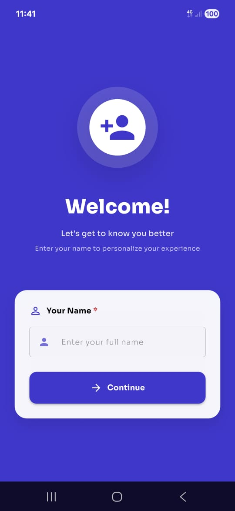

# ✅ GetItDone - Task Management App

GetItDone is a modern **Task Management App** built with **Flutter**, following **Clean Architecture** principles and powered by the **BLoC (Business Logic Component) pattern**.  
It helps you stay productive by organizing your tasks efficiently while keeping the app lightweight with **local database storage (SharedPreferences)**.

---

## 📱 App Preview

---

## ✨ Features

- 📝 Add, update, and delete tasks
- 🔍 Search for tasks by title
- 📅 **Sort tasks by date**
- 📂 Organize tasks by categories
- ⏰ Mark tasks as complete/incomplete
- 💾 Persistent storage with **SharedPreferences**
- ⚡ Built with **BLoC** for state management
- 🏗️ **Clean Architecture** for scalable code

---

